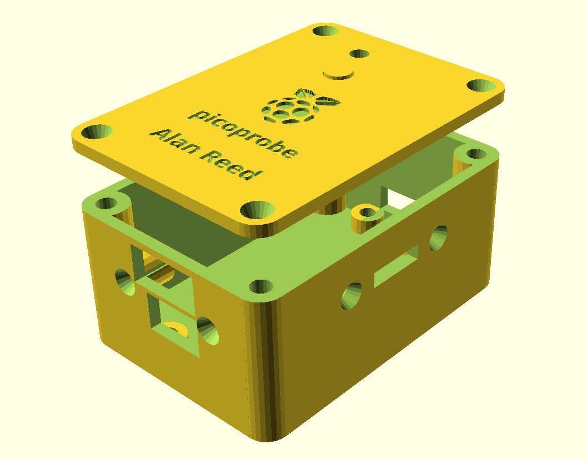

# Picoprobe enclosure
An enclosure design for a Raspberry Pi Pico programmed with PicoProbe, providing convenient access to SWD and serial connections along with a switch to select voltage source. Further details can be found in the [writeup on my personal site](https://areed.me/posts/2021-10-11_designing_an_enclosure_for_the_raspberry_pi_picoprobe).

Raspberry Pi logo model sourced from [Thingiverse](https://www.thingiverse.com/thing:3099888/files).

Raspberry Pi Pico Kicad footprint library sourced from [Github](https://github.com/ncarandini/KiCad-RP-Pico/).
